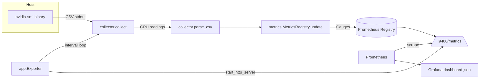

# gpu-exporter

[](https://github.com/theraihanrakibb/gpu-exporter/actions/workflows/ci.yml)
[](LICENSE)
[](https://www.python.org/downloads/release/python-3110/)

A lightweight, dependency-light **Prometheus exporter for NVIDIA GPU metrics**, built
for GPU fleet observability. It parses `nvidia-smi` output into structured
Prometheus metrics and serves them on `/metrics`. It **degrades gracefully** — when
no GPU or `nvidia-smi` is present (e.g. CI, CPU laptops, non-GPU nodes) it keeps
serving and reports `gpu_collector_up 0` instead of crashing.

Pure-Python, no `torch`, no `pynvml`, no native bindings. Tests pass with **no GPU,
no network, no large downloads**.

---

## Overview

`gpu-exporter` answers the questions every ML platform team eventually asks:

- *Which GPUs in the fleet are actually being used, and by how much?*
- *Are we thermally or power throttling during training?*
- *How much VRAM is free for the next job / for capacity planning?*
- *Is the exporter itself healthy on every node?*

It runs anywhere Python 3.11 runs: as a standalone exporter, inside a container on a
GPU node, or imported as a library in your own tooling.

## Architecture



| Layer | Module | Responsibility |
|-------|--------|----------------|
| Parse | `gpu_exporter/collector.py` | Run/parse `nvidia-smi` CSV → `GPUReading` dataclasses |
| Metrics | `gpu_exporter/metrics.py` | Register & update Prometheus gauges (per-GPU labels) |
| Expose | `gpu_exporter/app.py` | HTTP server + collection loop |
| CLI | `gpu_exporter/cli.py` | `python -m gpu_exporter` entry point |

## Quickstart

```bash
# Install
python -m pip install -r requirements.txt

# Run the exporter (serves http://localhost:9400/metrics)
python -m gpu_exporter

# Or with explicit options
python -m gpu_exporter --port 9400 --interval 5

# Point Prometheus at it (prometheus.yml)
scrape_configs:
  - job_name: gpu
    static_configs:
      - targets: ['localhost:9400']
```

### Run with a fixture (no GPU needed)

```bash
python -m gpu_exporter --collector-text "$(cat sample.csv)"
```

### As a library

```python
from gpu_exporter import collect, MetricsRegistry
from prometheus_client import CollectorRegistry

registry = CollectorRegistry()
metrics = MetricsRegistry(registry)
readings, up = collect()           # up=False on machines without nvidia-smi
metrics.update(readings, up)
print(up, len(readings))
```

### Docker

```bash
docker build -t gpu-exporter .
# On a GPU host with the NVIDIA Container Toolkit:
docker run --gpus all -p 9400:9400 gpu-exporter
```

## Metrics reference

All per-GPU metrics carry the labels `index`, `uuid`, and `name`.

| Metric | Type | Unit | Description |
|--------|------|------|-------------|
| `gpu_utilization_percent` | Gauge | % | Core utilization (0–100). |
| `gpu_memory_used_bytes` | Gauge | bytes | VRAM currently in use. |
| `gpu_memory_total_bytes` | Gauge | bytes | Total installed VRAM. |
| `gpu_temperature_celsius` | Gauge | °C | Die temperature. |
| `gpu_power_draw_watts` | Gauge | W | Instantaneous power draw. |
| `gpu_power_limit_watts` | Gauge | W | Configured power limit. |
| `gpu_fan_speed_percent` | Gauge | % | Fan speed (0–100). |
| `gpu_pcie_tx_bytes` | Gauge | bytes | PCIe TX throughput (optional). |
| `gpu_pcie_rx_bytes` | Gauge | bytes | PCIe RX throughput (optional). |
| `gpu_count` | Gauge | count | GPUs discovered in last collection. |
| `gpu_collector_up` | Gauge | 0/1 | 1 if `nvidia-smi` ran, 0 on missing/error. |

## Why this matters for AI infra

GPUs are the most expensive and scarcest resource in an ML platform, yet they are
frequently **under-utilized or silently throttled**. Fleet-wide, exportable metrics
are the foundation for running GPUs as a reliable, measurable substrate:

- **Fleet observability & capacity planning** — Aggregate `gpu_utilization_percent`
  and `gpu_memory_used_bytes` across the cluster to see idle capacity, right-size
  node pools, and decide when to buy more hardware.
- **Catching thermal / power throttling** — A drop in `gpu_utilization_percent`
  alongside a spike in `gpu_temperature_celsius` or `gpu_power_draw_watts` hitting
  `gpu_power_limit_watts` is a classic throttle signature. Without per-GPU metrics
  these losses are invisible and silently waste compute budget.
- **SLOs for training clusters** — Alert on `gpu_collector_up == 0` to detect a
  node where the driver/exporter died, and on temperature/power envelopes to protect
  hardware. `gpu_count` lets you detect GPUs that vanished mid-run (driver crash,
  ECC errors, preemption).
- **Cost attribution** — Per-`uuid` labels let you attribute utilization and energy
  to specific jobs, tenants, or teams for showback/chargeback.

Because the exporter **degrades gracefully**, you can roll it out to *every* node —
GPU and CPU alike — with a single dashboard and a single alerting rule, instead of
special-casing GPU hosts.

## Grafana dashboard

A ready-to-use dashboard is provided in [`grafana/dashboard.json`](grafana/dashboard.json)
with panels for utilization, memory, temperature, power, fan speed, and collector
health. Import it into Grafana and point it at your Prometheus datasource.

## Future work

- Add DCGM-exporter compatible metrics / NVML-based collection path as an optional
  backend (still pure-Python, lazily imported).
- XID error and ECC counter parsing for hardware-health signals.
- MIG (Multi-Instance GPU) slice-level metrics.
- Histogram metrics for utilization distribution over scrape windows.
- Helm chart / systemd unit for Kubernetes DaemonSet deployment.

## License

MIT © MD RAKIBUL ISLAM RAIHAN — see [LICENSE](LICENSE).
